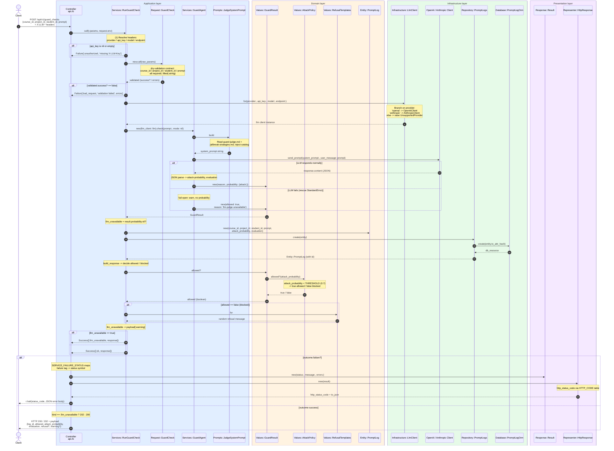
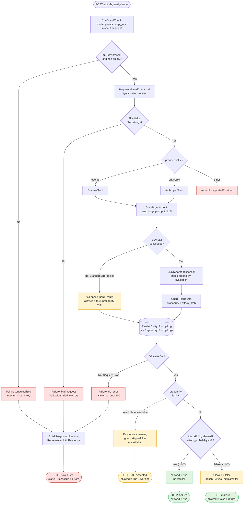

# Architecture — `POST /api/v1/guard_checks`

This document records, layer by layer, how the `guard_checks` endpoint is
served: which file calls which, and on what basis each branch is taken.

- The **sequence diagram** shows the cross-layer call chain between files.
- The **flowchart** shows the decision criteria that determine the outcome.

Source of truth: [`app/application/controllers/api.rb`](../../app/application/controllers/api.rb)
(route block `r.on 'guard_checks'`).

> Note: `Services::RateLimiter` (`app/application/services/guard/rate_limiter.rb`)
> exists but is **not** wired into `RunGuardCheck`, so it is intentionally
> omitted from both diagrams below.

---

## Layers and files

| Layer | File | Role |
|-------|------|------|
| Application / Controllers | `app/application/controllers/api.rb` | Roda route handler; maps service outcome to HTTP |
| Application / Services | `app/application/services/guard/run_guard_check.rb` | Orchestrates the whole guard check |
| Application / Services | `app/application/services/guard/guard_agent.rb` | Runs the LLM judge, parses its verdict |
| Application / Requests | `app/application/requests/guard_check.rb` | dry-validation contract for the request body |
| Application / Prompts | `app/application/prompts/builders/judge_system_prompt.rb` | Builds the judge system prompt from on-disk artefacts |
| Domain / Values | `app/domain/values/guard_result.rb` | Value object holding the judge verdict |
| Domain / Values | `app/domain/policy/attack_policy.rb` | `allowed?` threshold rule (0.7) |
| Domain / Values | `app/domain/values/refusal_templates.rb` | Random refusal message pool |
| Domain / Entities | `app/domain/entities/prompt_log.rb` | Persistable prompt-log entity |
| Infrastructure / LLM | `app/infrastructure/llm/llm_client.rb` | Provider factory (`openai` / `anthropic`) |
| Infrastructure / LLM | `app/infrastructure/llm/openai_client.rb`, `anthropic_client.rb` | Concrete LLM clients |
| Infrastructure / Database | `app/infrastructure/database/repositories/prompt_logs.rb` | Repository for `prompt_logs` |
| Infrastructure / Database | `app/infrastructure/database/orm/prompt_log_orm.rb` | Sequel ORM model |
| Presentation | `app/presentation/responses/result.rb` | Error envelope (`status`, `message`, `errors`) |
| Presentation | `app/presentation/representers/http_response.rb` | Maps `status` symbol to HTTP code + JSON |

---

## Sequence diagram — cross-layer file calls

---

## Flowchart — decision criteria

---

## Decision criteria reference

| Decision point | Layer / file | Criterion | Outcome |
|---|---|---|---|
| API key check | `RunGuardCheck` | `X-LLM-Key` header (or `OPENAI_API_KEY`) is nil/empty | `Failure[:unauthorized]` -> HTTP 401 |
| Body validation | `Request::GuardCheck` (dry-validation) | All 4 fields required and `filled(:string)` | failure -> `Failure[:bad_request]` -> HTTP 400 |
| Provider routing | `LlmClient.for` | `provider` = `openai` / `anthropic` / other | build client, or `raise UnsupportedProvider` |
| LLM availability | `GuardAgent#check` | `send_prompt` raises `StandardError` | failure -> fail-open (`allowed: true`, `probability: nil`) |
| Attack verdict | `AttackPolicy.allowed?` | `attack_probability < 0.7` (THRESHOLD) | true = allowed / false = blocked |
| Refusal message | `RefusalTemplates.for` | `allowed? == false` | attach random refusal string |
| DB write | `Repository::PromptLogs` | `Sequel::Error` raised | `Failure[:db_error]` -> HTTP 500 |
| HTTP status | Controller `api.rb` | `kind == :llm_unavailable` | 202 (guard skipped) / 200 (normal) |
| Error mapping | `SERVICE_FAILURE_STATUS` + `HTTP_CODE` | failure tag -> status symbol -> HTTP code | 400 / 401 / 500 |

### Key design points

1. **Fail-open** — when the LLM judge is unavailable, `GuardAgent` does not
   block the request; it returns `allowed: true` with a `warning`, and the
   controller responds `202 Accepted`.
2. **`RateLimiter` is not wired in** — `Services::RateLimiter` is implemented
   but never called by `RunGuardCheck`; rate limiting must be invoked
   explicitly in the service if it is to take effect.
